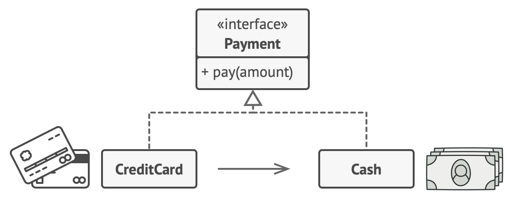
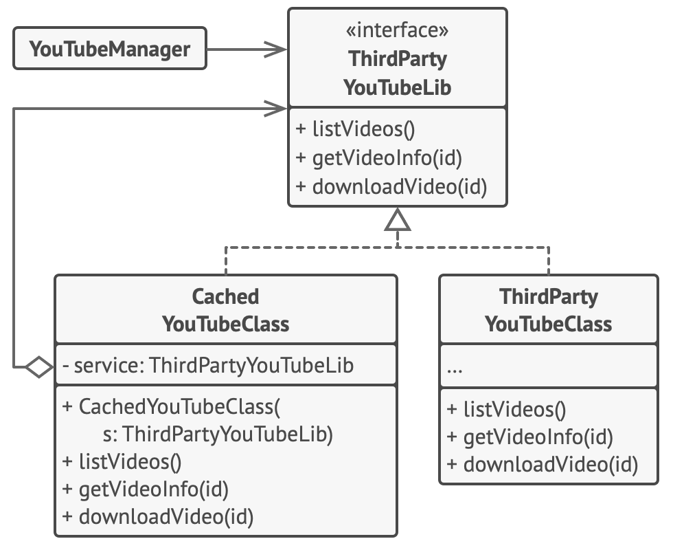

## Proxy Design Pattern in JavaScript

### Intent

`Proxy` is a structural design pattern that lets you provide a substitute or placeholder for another object. A proxy controls access to the original object, allowing you to perform something either before or after the request gets through to the original object.

### Problem

Why would you want to control access to an object? Here is an example: you have a massive object that consumes a vast amount of system resources. You need it from time to time, but not always.

You could implement lazy initialization: create this object only when it’s actually needed. All of the object’s clients would need to execute some deferred initialization code. Unfortunately, this would probably cause a lot of code duplication.

In an ideal world, we’d want to put this code directly into our object’s class, but that isn’t always possible. For instance, the class may be part of a closed 3rd-party library.

### Solution

The Proxy pattern suggests that you create a new proxy class with the same interface as an original service object. Then you update your app so that it passes the proxy object to all of the original object’s clients. Upon receiving a request from a client, the proxy creates a real service object and delegates all the work to it.

But what’s the benefit? If you need to execute something either before or after the primary logic of the class, the proxy lets you do this without changing that class. Since the proxy implements the same interface as the original class, it can be passed to any client that expects a real service object.

## Real World Analogy

A credit card is a proxy for a bank account, which is a proxy for a bundle of cash. Both implement the same interface: they can be used for making a payment. A consumer feels great because there’s no need to carry loads of cash around. A shop owner is also happy since the income from a transaction gets added electronically to the shop’s bank account without the risk of losing the deposit or getting robbed on the way to the bank.

### Structure

[1]
The `Service Interface` declares the interface of the Service. The proxy must follow this interface to be able to disguise itself as a service object.
[2]
The `Service` is a class that provides some useful business logic.

[3]
The `Proxy` class has a reference field that points to a service object. After the proxy finishes its processing (e.g., lazy initialization, logging, access control, caching, etc.), it passes the request to the service object.
[4]
The `Client` should work with both services and proxies via the same interface. This way you can pass a proxy into any code that expects a service object.

### Pseudocode

This example illustrates how the `Proxy` pattern can help to introduce lazy initialization and caching to a 3rd-party YouTube integration library.

The library provides us with the video downloading class. However, it’s very inefficient. If the client application requests the same video multiple times, the library just downloads it over and over, instead of caching and reusing the first downloaded file.

The proxy class implements the same interface as the original downloader and delegates it all the work. However, it keeps track of the downloaded files and returns the cached result when the app requests the same video multiple times.
